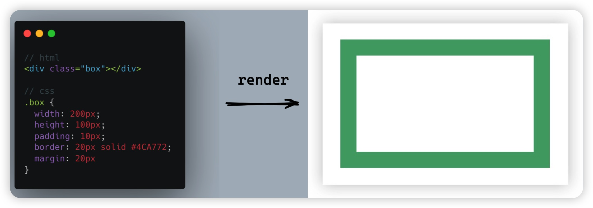
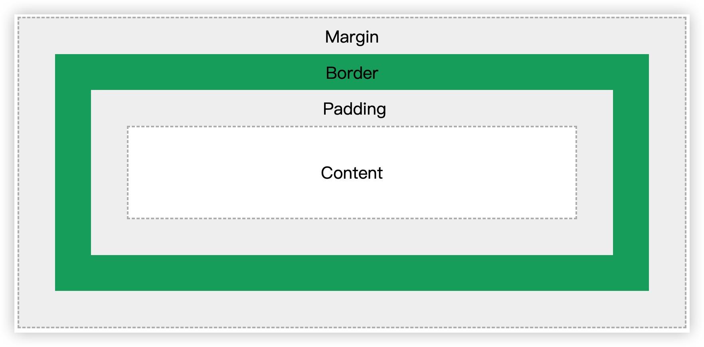
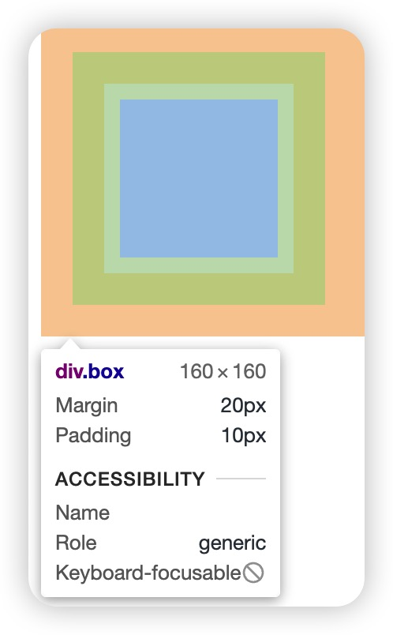
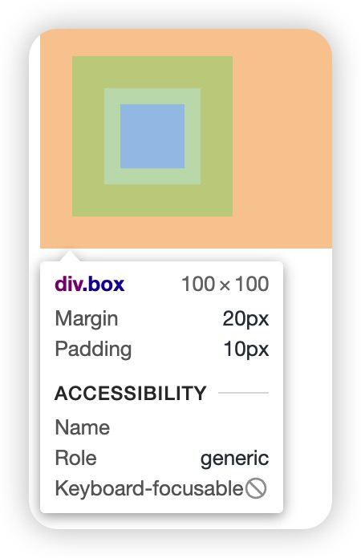
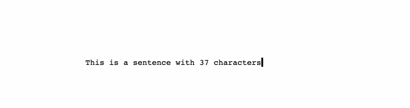
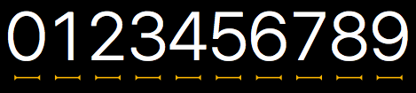
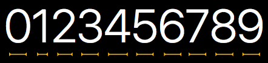

# css tricks

---

1. Clickable area

2. Box model

3. Draw a triangle

4. Typewriter animation

---

## Clickable area

```css
.btn::before {
  content: "";
  position: absolute;
  top: -20px;
  right: -20px;
  bottom: -20px;
  left: -20px;
}
```

[codepen](https://codepen.io/booltcher/pen/PoRyqjp?editors=1111)

---

## Box model

---

When laying out a document, the browser's rendering engine represents each element as a rectangular box. 

CSS determines the size, position, and properties (color, background, border size, etc.) of these boxes.



---

**Every box is composed of four parts:**



- *content* 

- *padding*

- *border*

- *margin*


---

## Box model type

---

CSS has **two** box models: 

- Standard box model

- IE box model

---

## Standard box model

The specification defined by W3C organization.

The **default** behavior of most browsers.

`width,height` => content

---

```css
.box {
  width: 100px;
  height: 100px;
  padding: 10px;
  border: 20px solid #4CA772;
  margin: 20px;
}
```



---

## IE box model

Behavior of IE5 and IE6

`width,height` => content + padding + border

---

```css
.box {
  width: 100px;
  height: 100px;
  padding: 10px;
  border: 20px solid #4CA772;
  margin: 20px;
  box-sizing: border-box;
}
```



---

**box-sizing**

- `content-box(default value)`  - standard box model

- `border-box` - IE box model

- `inherit`

---

## Usage

---

## Draw a triangle

[codepen](https://codepen.io/booltcher/pen/GRxxpmo)

---

## Typewriter animation

---



[codepen](https://codepen.io/booltcher/pen/YzaaPrQ?editors=1100)

---

#### animation

It is a shorthand for 

1. <mark>animation-name  </mark>
2. <mark>animation-duration  </mark>
3. <mark>animation-timing-function</mark>
4. animation-delay
5. <mark>animation-iteration-count </mark>
6. animation-direction
7. animation-fill-mode
8. animation-play-state.

---

`animation-name` 

Specifies the name of the [`@keyframes`](https://developer.mozilla.org/en-US/docs/Web/CSS/@keyframes) at-rule describing the animation's keyframes.

---

`animation-duration`

Configures the length of time that an animation should take to complete one cycle.

---

`animation-timing-function`

Configures the timing of the animation; how the animation transitions through keyframes.

---

## steps()

`steps(number_of_steps: number, direction?: )`

---

#### ch(character) unit

A relative unit, representing the width of the character "0" in the current font.

---

#### Monospaced vs Proportional font

---

## Monospaced font

Each character occupies the same amount of space on a line of text.



> Courier, Roboto Mono, Inconsolata, Source Code Pro etc.

---

## Proportional font

Each character occupies only as much width as it needs.



> Times, Arial, Verdana, Georgia etc.

---

`animation-iteration-count`

Configures the number of times the animation should repeat; you can specify `infinite` to repeat the animation indefinitely.

---

# Thank you!
